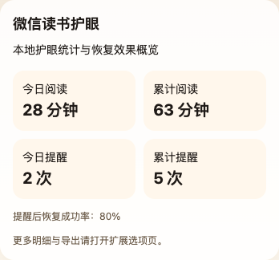
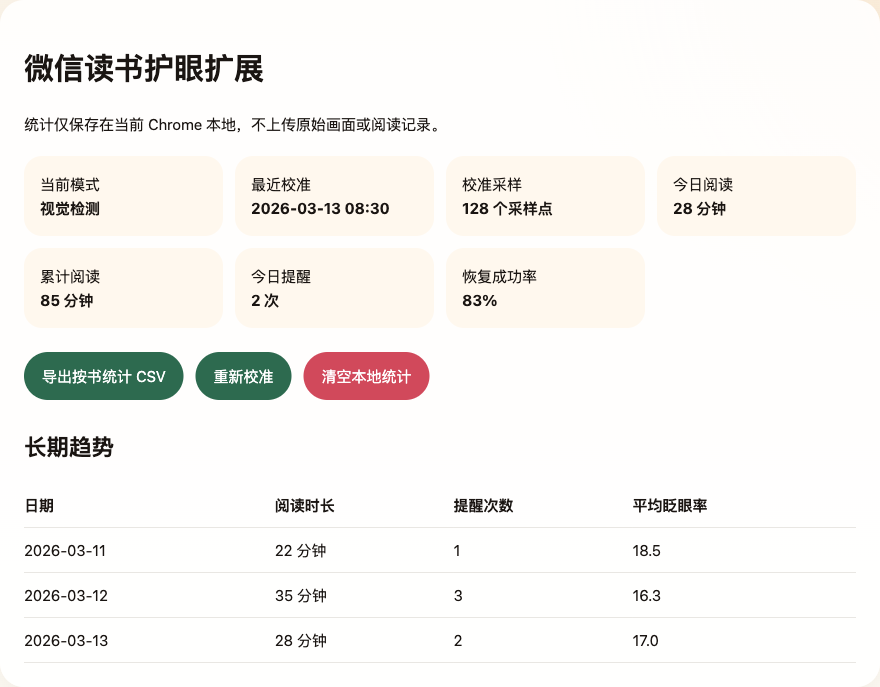
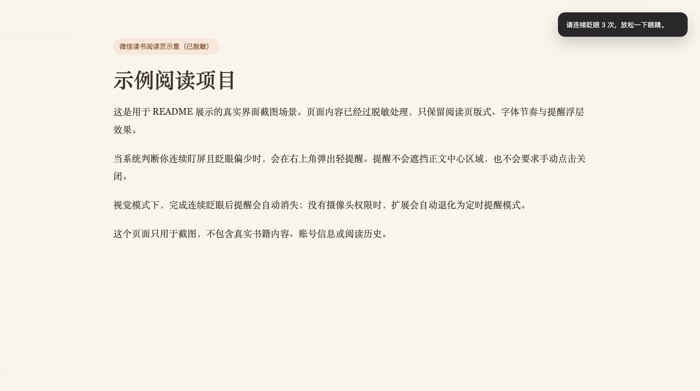

# WeRead Eye Care Extension

一个面向 `微信读书 Web` 的 Chrome 护眼扩展。

它会在你阅读时：

- 判断你是否处于活跃阅读状态
- 在本地分析摄像头画面，估计你是否持续盯屏且眨眼偏少
- 在合适的时机弹出轻提醒，提示你眨眼休息
- 在 popup 里显示当前模式、当前策略和最早可能再次提醒的时间
- 在本地保存阅读时长、提醒次数、眨眼率和恢复效果统计
- 支持导出按书聚合的 CSV 数据

## 主要特点

- `Chrome Extension (Manifest V3)`
- `V1` 只支持 `https://weread.qq.com/web/reader/*`
- 首次使用支持本地校准个人眨眼基线
- 支持 `保守 / 标准 / 敏感` 三档提醒策略
- 摄像头画面只做本地实时分析，不上传、不落盘
- 摄像头启动失败时会显示用户可读原因，并自动降级为定时提醒模式
- 统计默认保存在 `chrome.storage.local`

## 快速开始

```bash
npm install
npm run build
```

然后在 Chrome 中：

1. 打开 `chrome://extensions`
2. 开启 `开发者模式`
3. 点击 `加载已解压的扩展程序`
4. 选择 `dist/`

## 文档

- [原理与使用说明](docs/principles-and-usage.md)
- [手工验收清单](docs/manual-qa-checklist.md)

## 插件截图

真实界面截图，已做脱敏处理。

### Popup



### Options



### 阅读页提醒浮层



## 开发验证

```bash
npm test -- --run
npx tsc --noEmit
npm run build
```

## 备注

- MediaPipe wasm 和 face landmarker 模型会被打包到 `dist/assets/mediapipe`
- 第一次进入微信读书阅读页时会请求摄像头权限并执行本地校准
- 如果拒绝摄像头权限、没有可用摄像头，或视觉组件加载失败，扩展会自动切换到定时提醒模式
